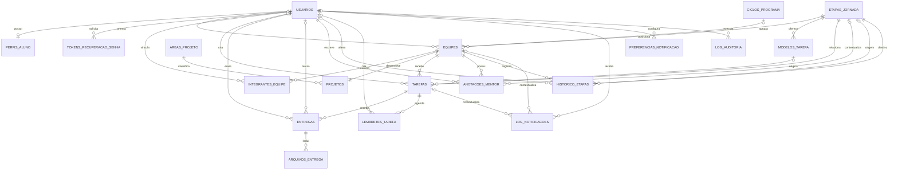

# Modelo do banco — InfoHub → InovAMF

Este modelo evolui a estrutura inicial criada pela equipe, preservando os nomes principais em português. As correções evitam valores configuráveis fixados em colunas, perda de histórico por exclusão em cascata e sobrescrita de entregas.

## Diagrama ER

## Tabelas

- `usuarios`: contas ADMIN, MENTOR e STUDENT. Guarda apenas `senha_hash`, timestamps de consentimento, exclusão lógica e anonimização.
- `tokens_recuperacao_senha`: recuperação separada da conta; armazena apenas hash do token, validade e utilização.
- `perfis_aluno`: curso e semestre, separados dos dados genéricos de autenticação.
- `ciclos_programa`: períodos/turmas usados nos filtros e relatórios.
- `etapas_jornada`: catálogo extensível da jornada. As seis etapas são dados de seed, não colunas nem ENUM.
- `areas_projeto`: catálogo configurável de áreas.
- `equipes`: posição atual, mentor, ciclo e estado da equipe. Usa status e exclusão lógica.
- `integrantes_equipe`: membros com ou sem conta. `usuario_id` é opcional e não existe limite fixo de participantes.
- `projetos`: ideia desenvolvida pela equipe, separada da equipe para normalização.
- `modelos_tarefa`: tarefas reutilizáveis associadas às etapas.
- `tarefas`: instâncias atribuídas a uma equipe, com prazo, obrigatoriedade e estado.
- `entregas`: uma linha por versão enviada, protegida por `UNIQUE (tarefa_id, numero_versao)`.
- `arquivos_entrega`: vários arquivos ou URLs por entrega. O PostgreSQL guarda somente metadados/localização.
- `anotacoes_mentor`: conteúdo interno, opcionalmente contextualizado por etapa.
- `historico_etapas`: registro append-only de entrada, avanço ou retrocesso.
- `lembretes_tarefa`: agendamentos automáticos ou manuais e tentativas de envio.
- `log_notificacoes`: rastreabilidade de e-mail e futuro WhatsApp.
- `preferencias_notificacao`: preparação para opt-out por tipo e canal.
- `log_auditoria`: alterações importantes com snapshots JSONB mínimos.

## Decisões de modelagem

### UUID

Entidades principais usam UUID com `gen_random_uuid()`. Isso evita IDs sequenciais expostos pela futura API e facilita integrações.

### Estados com CHECK

Papéis e estados usam `VARCHAR` com `CHECK`, em vez de ENUM PostgreSQL. Os valores são pequenos e controlados, mas essa escolha facilita migrations futuras e mantém o contrato visível para qualquer tecnologia de backend. Etapas e áreas são tabelas porque são configuráveis.

### Equipe e projeto separados

A base original armazenava os dados da ideia dentro de `equipes`. Eles foram separados para que a equipe represente pessoas e jornada, enquanto `projetos` representa a ideia, área e maturidade. Nesta versão existe um projeto por equipe por meio de `UNIQUE (equipe_id)`.

### Líder como integrante

O antigo `lider_id` de `equipes` foi substituído por `integrantes_equipe.papel_na_equipe = 'LEADER'`, evitando duas fontes de verdade. Um índice parcial permite um líder ativo por equipe. A futura API deve criar o líder e a equipe na mesma transação.

### Histórico protegido

Equipes, tarefas, entregas, arquivos, anotações e histórico usam `ON DELETE RESTRICT`. `CASCADE` ficou restrito a dados auxiliares sem valor histórico, como tokens e preferências. Equipes e usuários importantes devem ser desativados/excluídos logicamente.

### Datas

Timestamps relevantes usam `TIMESTAMPTZ`. A função `definir_atualizado_em()` é o único mecanismo genérico de trigger, aplicado apenas a tabelas mutáveis.

## Responsabilidade do PostgreSQL

- tipos, nulabilidade e faixas válidas;
- chaves primárias, estrangeiras e unicidade;
- estados permitidos;
- uma versão única por tarefa;
- localização obrigatória para arquivo ou URL;
- integridade temporal básica;
- preservação das referências históricas;
- índices para as consultas previstas.

## Responsabilidade da futura API

- autenticação, autorização e hash seguro das senhas;
- validar que o usuário possui o papel correto para cada relação;
- cadastro inicial atômico de usuário, perfil, equipe, líder, projeto e histórico;
- verificar tarefas obrigatórias antes de avançar etapas;
- permitir avanço manual somente a perfis autorizados;
- sincronizar `equipes.etapa_atual_id` e `historico_etapas` na mesma transação;
- atualizar automaticamente tarefas vencidas para `OVERDUE`;
- gerar o próximo `numero_versao` com controle de concorrência;
- uploads para S3, R2, Supabase Storage ou MinIO;
- e-mails, retentativas, recuperação de senha e tokens de sessão;
- alimentar `log_auditoria` sem copiar dados pessoais desnecessários.

## Índices principais

- equipes por etapa, mentor, status e ciclo;
- busca aproximada por nomes de usuário, equipe e projeto com `pg_trgm`;
- curso de aluno/integrante e área do projeto;
- tarefas por equipe, etapa, status e prazo;
- índice parcial de candidatas a atraso;
- entregas mais recentes e pendentes de revisão;
- lembretes e notificações pendentes por horário;
- histórico, anotações e auditoria por entidade/data.

## LGPD — decisões técnicas

- coleta separada dos dados acadêmicos e pessoais;
- senha e token de recuperação somente em hash;
- exclusão lógica e campo para anonimização futura;
- consentimento e versão da política registráveis;
- arquivos fora do banco;
- rastreabilidade por histórico e auditoria;
- JSONB de auditoria deve receber somente campos necessários;
- retenção, prazo de exclusão e base legal dependem de definição institucional e não foram inventados no esquema.

## Decisões pendentes

- **Login de integrantes:** `usuario_id` opcional permite conta própria ou cadastro apenas pelo líder.
- **Perfil do mentor:** já existe `MENTOR`, mas permissões e escopo serão definidos pela API.
- **Pitch:** `arquivos_entrega` aceita chave de storage, URL externa ou ambos.
- **Participação simultânea:** não há restrição global impedindo o usuário de estar em várias equipes; a regra permanece para decisão da coordenação/backend.
- **Número máximo de integrantes:** não foi fixado.
- **Pós-InovAMF:** novas etapas podem ser inseridas no catálogo sem migration estrutural.
- **Serviço de e-mail:** o log é independente do provedor.
